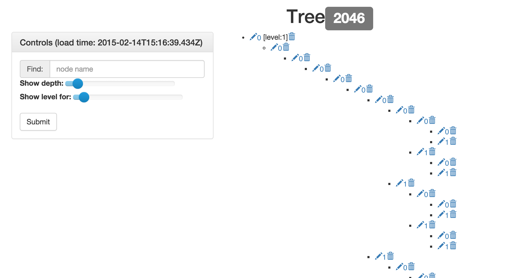

# Simple Web-App for Working with Trees in PostgresSQL
Used versions:
  * django version `1.7.1`
  * python version `2.7.9`

## Strucutre

* / _root dir_
  * fill_db.py _creating simple tree in external DB_
  * manage.py _no comments_
  * README.md _this file_
  * static _base static dir_
  * templates _base templates dir_
  * tree _tree application_
    * controller.py _interaction with DB_
    * static _app statci files --- js and css_
    * templates _app templates_
    * views.py _pages rendering and ajax responds_
  * tree_django _settings storage_
